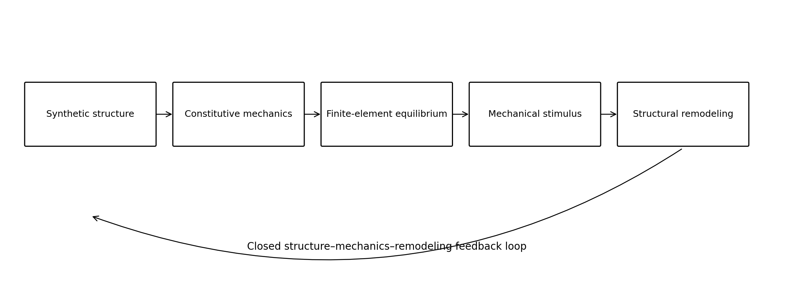
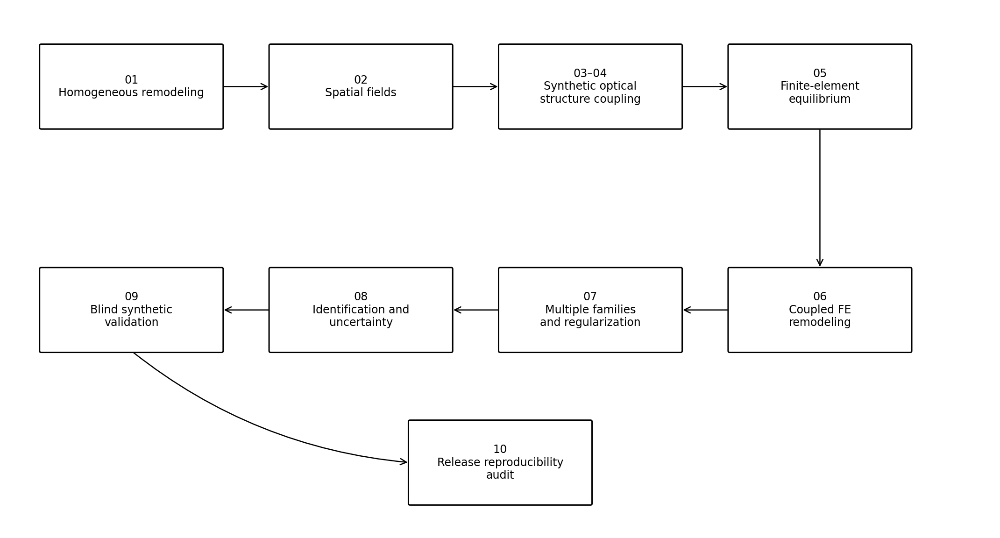
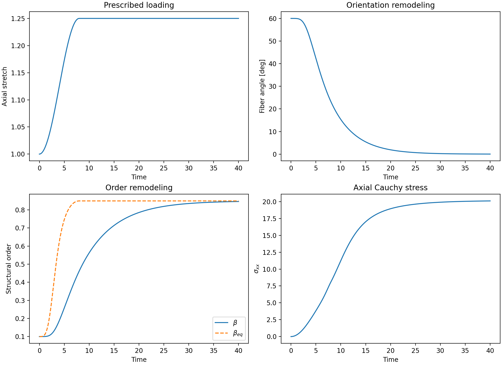
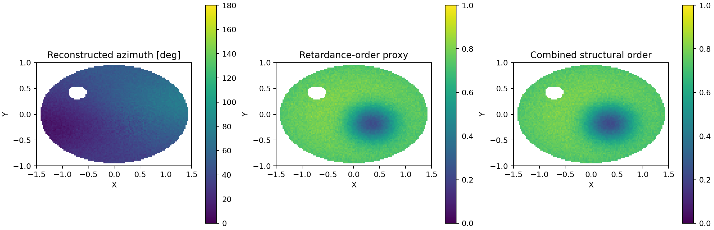
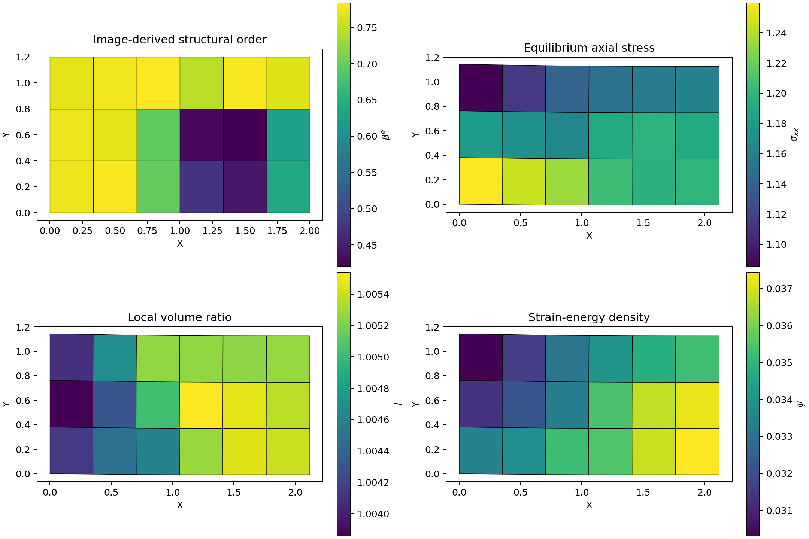
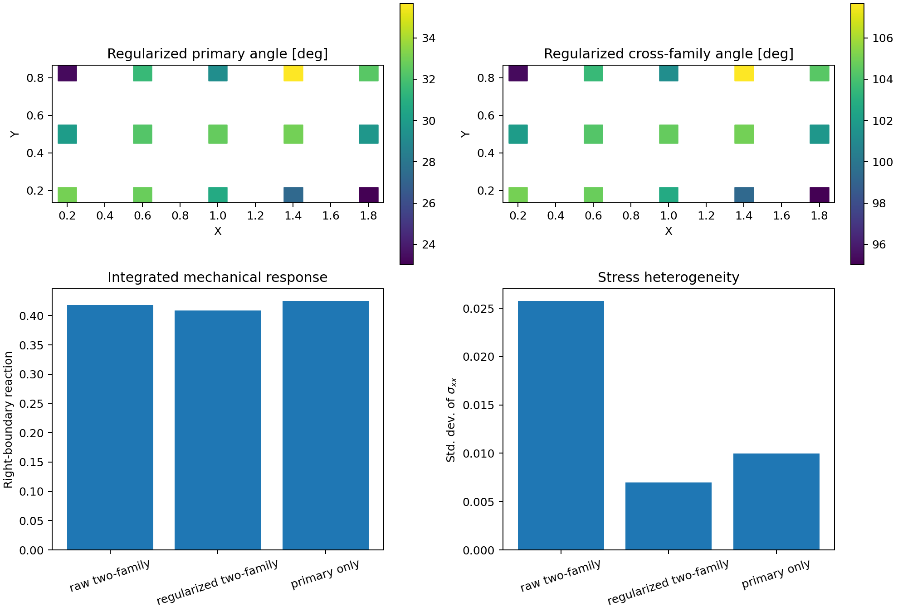
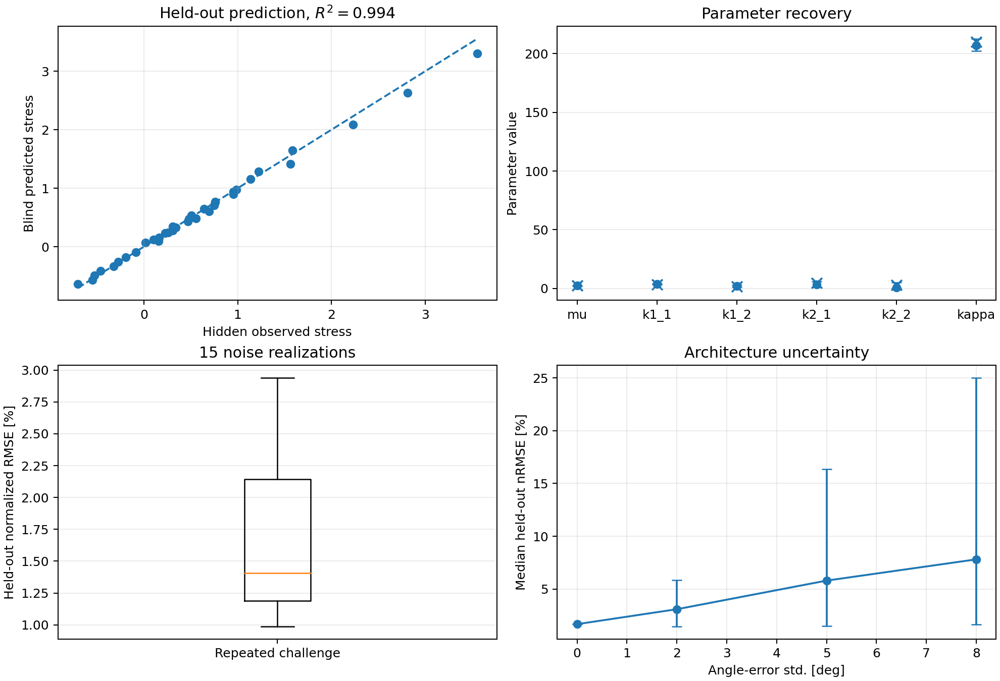

# Anisotropic Soft Tissue Remodeling

[](https://github.com/Data-Driven-Biomedicine-Lab/Anisotropic-Soft-Tissue-Remodeling/actions/workflows/ci.yml)


**A reproducible finite-strain computational framework for anisotropic soft-tissue structure, mechanics, and remodeling.**

**Author:** Karina Urazova  
**Repository:** <https://github.com/Data-Driven-Biomedicine-Lab/Anisotropic-Soft-Tissue-Remodeling>

<p align="center">
  
</p>

## 1. Scientific purpose

Fibrous soft tissues adapt their architecture in response to mechanical loading.
The local orientation of load-bearing constituents determines the anisotropic
stress response; the resulting stress and strain fields create stimuli that can
alter orientation, structural order, and effective stiffness. This repository
implements that feedback loop in a compact, testable, and extensible Python
framework.

The central computational chain is

$$
\text{structural state}
\longrightarrow
\text{constitutive response}
\longrightarrow
\text{mechanical equilibrium}
\longrightarrow
\text{remodeling stimulus}
\longrightarrow
\text{updated structural state}.
$$

Version 1.0 unifies homogeneous material-point models, spatial fields,
synthetic polarimetry-like reconstruction, finite-element equilibrium,
multi-family fiber architectures, inverse parameter identification, and blind
held-out validation.

## 2. Evidence status and data policy

Every distributed input, map, observation, hidden target, table, and figure is
**fully synthetic** and generated by this repository. No external,
experimental, clinical, or third-party dataset is included or required.

The release therefore supports the following claims:

- the equations are implemented consistently;
- analytical stresses agree with numerical energy derivatives;
- the finite-element solver satisfies equilibrium to stated tolerances;
- remodeling variables remain physically bounded;
- synthetic inverse problems can be solved and evaluated on held-out loading
  paths;
- benchmark results are reproducible from documented seeds.

The release does **not** establish experimental or clinical validity for any
specific biological tissue. See [`docs/synthetic_data_policy.md`](docs/synthetic_data_policy.md).

## 3. Mathematical formulation

### 3.1 Finite-strain kinematics

The deformation map is described by the deformation gradient

$$
\mathbf F = \frac{\partial \mathbf x}{\partial \mathbf X},
\qquad
J = \det \mathbf F > 0,
$$

and the right Cauchy–Green tensor

$$
\mathbf C = \mathbf F^{\mathsf T}\mathbf F.
$$

For a two-dimensional material, the isotropic and fiber invariants are

$$
I_1 = \operatorname{tr}\mathbf C,
\qquad
I_{4m} = \mathbf a_0^{(m)}\cdot\mathbf C\mathbf a_0^{(m)},
$$

where $\mathbf a_0^{(m)}$ is the reference direction of fiber family $m$.
Directions are nematic:

$$
\mathbf a_0^{(m)} \equiv -\mathbf a_0^{(m)}.
$$

### 3.2 Matrix energy

The compressible neo-Hookean matrix contribution is

$$
\psi_{\mathrm m}
=
\frac{\mu}{2}
\left(I_1-2-2\ln J\right)
+
\frac{\kappa}{2}(\ln J)^2,
$$

where $\mu>0$ controls the matrix shear response and $\kappa>0$ penalizes
volume change.

### 3.3 Tension-only fiber energy

For $M$ discrete fiber families, the total strain-energy density is

$$
\psi
=
\psi_{\mathrm m}
+
\sum_{m=1}^{M}
 w_m\beta_m
\frac{k_{1m}}{2k_{2m}}
\left[
\exp\left(
 k_{2m}\langle I_{4m}-1\rangle_+^2
\right)-1
\right],
$$

with normalized mixture weights

$$
 w_m\ge 0,
\qquad
\sum_{m=1}^{M}w_m=1,
$$

and structural-order variables

$$
0\le\beta_m\le1.
$$

The positive-part operator $\langle x\rangle_+=\max(x,0)$ suppresses the
fiber contribution in compression.

### 3.4 Stress measures

The first Piola–Kirchhoff stress is evaluated analytically:

$$
\mathbf P = \frac{\partial\psi}{\partial\mathbf F}.
$$

The Cauchy stress is

$$
\boldsymbol\sigma
=
\frac{1}{J}\mathbf P\mathbf F^{\mathsf T}.
$$

Unit tests compare the analytical $\mathbf P$ against central finite
differences of the energy. In the multi-family benchmark, the relative
Frobenius error is of order $10^{-10}$.

### 3.5 Mechanical remodeling stimulus

Directional loading anisotropy is measured from the principal stretches:

$$
S
=
\left|
\ln\lambda_{\max}
-
\ln\lambda_{\min}
\right|.
$$

This choice satisfies $S=0$ under isotropic stretch and therefore avoids
creating an artificial preferred direction in a degenerate principal-stretch
state.

The equilibrium structural order is represented by a bounded Hill law:

$$
\beta_{\mathrm{eq}}(S)
=
\beta_{\min}
+
(\beta_{\max}-\beta_{\min})
\frac{S^n}{S_{1/2}^n+S^n}.
$$

The kinetic equation is

$$
\dot\beta
=
 k_\beta\left(\beta_{\mathrm{eq}}-\beta\right).
$$

Fiber directions relax toward the maximum principal-stretch direction in
nematic angle space. The implementation uses bounded exponential updates,
which prevents overshoot for positive time steps.

### 3.6 Synthetic polarimetry-like structural reconstruction

Synthetic azimuth and retardance-like fields are converted into mechanical
state variables through

$$
\mathbf a_0(x,y)
=
\begin{bmatrix}
\cos\alpha(x,y)\\
\sin\alpha(x,y)
\end{bmatrix},
$$

and an explicit normalized retardance proxy

$$
\widehat R
=
\operatorname{clip}
\left(
\frac{R-R_{\min}}{R_{\max}-R_{\min}},0,1
\right).
$$

A calibrated order proxy is

$$
\beta_R
=
\beta_{\min}
+
(\beta_{\max}-\beta_{\min})\widehat R^{\,p}.
$$

Local nematic coherence is computed in doubled-angle space,

$$
q
=
\frac{\langle w e^{2i\alpha}\rangle}{\langle w\rangle},
\qquad
c=|q|,
$$

and the final structural-order variable is

$$
\beta=\beta_Rc.
$$

This mapping is deliberately described as a **synthetic structural proxy**; it
is not presented as an absolute physical calibration.

### 3.7 Finite-element equilibrium

The two-dimensional solver uses four-node bilinear quadrilateral elements in a
total-Lagrangian formulation. Mechanical equilibrium is

$$
\operatorname{Div}_{\mathbf X}\mathbf P=\mathbf0,
$$

with weak form

$$
\int_{\Omega_0}
\mathbf P:\nabla_{\mathbf X}\delta\mathbf u\,\mathrm dV
=0.
$$

Spatially varying fiber directions and structural-order parameters are stored
at the element level. The nonlinear displacement problem is solved by energy
minimization with analytical internal forces and load stepping.

### 3.8 Orientation distributions and regularization

A continuous planar orientation distribution can be approximated by discrete
quadrature directions. The implemented nematic von Mises density is

$$
\rho(\theta)
=
\frac{
\exp[\chi\cos 2(\theta-\bar\theta)]
}{\pi I_0(\chi)},
\qquad 0\le\theta<\pi,
$$

with theoretical coherence $I_1(\chi)/I_0(\chi)$.

Scalar element fields are regularized on the adjacency graph by solving

$$
(\mathbf I+\ell\mathbf L)\mathbf x=\mathbf y,
$$

where $\mathbf L$ is the graph Laplacian. Fiber directions are regularized in
$[\cos(2\alpha),\sin(2\alpha)]$ space, preserving head–tail symmetry.

### 3.9 Parameter identification

Positive constitutive parameters are optimized in logarithmic coordinates by
minimizing the weighted least-squares objective

$$
\Phi(\mathbf p)
=
\sum_{i=1}^{N}
\left[
\frac{
\sigma_i^{\mathrm{model}}(\mathbf p)
-
\sigma_i^{\mathrm{obs}}
}{s_i}
\right]^2.
$$

The inverse module provides local finite-difference sensitivities, singular
values, condition numbers, covariance and correlation estimates, and a
parametric bootstrap.

A key identifiability result is explicit: under strictly isochoric loading,
$J=1$ and $\ln J=0$, so the volumetric parameter $\kappa$ has zero sensitivity.
A non-isochoric protocol is required to identify it.

## 4. Computational progression

<p align="center">
  
</p>

The ten notebooks form a cumulative research workflow:

| Notebook | Main question | Principal output |
|---|---|---|
| `01_homogeneous_remodeling.ipynb` | Can a single material point remodel under finite strain? | Verified stress and bounded evolution |
| `02_spatial_fiber_field.ipynb` | How do heterogeneous fields evolve under compatible deformation? | Maps of orientation, order, energy, and stress |
| `03_polarimetry_to_structure.ipynb` | How can synthetic azimuth and retardance-like maps initialize mechanics? | $\mathbf a_0$, $\beta$, and structural tensors |
| `04_polarimetry_initialized_remodeling.ipynb` | How do reconstruction errors propagate through remodeling? | Oracle comparison against latent synthetic fields |
| `05_finite_element_equilibrium.ipynb` | How does spatial structure affect a mechanically coupled specimen? | Q4 equilibrium and reaction forces |
| `06_equilibrium_remodeling_coupling.ipynb` | Can equilibrium and structural evolution form a closed loop? | Time-dependent FE remodeling |
| `07_multiple_fiber_families_and_regularization.ipynb` | How do cross-families, dispersion, and denoising affect response? | Multi-family FE comparison |
| `08_parameter_identification_and_sensitivity.ipynb` | Which parameters can be recovered from synthetic protocols? | Fits, sensitivities, covariance, bootstrap |
| `09_synthetic_validation_challenge.ipynb` | Does the calibrated model predict unseen loading paths? | Blind held-out validation report |
| `10_release_reproducibility_audit.ipynb` | Is the complete v1.0 release reproducible from source? | Final automated release audit |

## 5. Representative results

### 5.1 Homogeneous remodeling

<p align="center">
  
</p>

The reference material point starts with an oblique fiber direction and low
structural order. Under area-preserving axial extension, the fiber rotates
toward the tensile axis while $\beta$ relaxes toward its stimulus-dependent
equilibrium value.

### 5.2 Synthetic structural reconstruction

<p align="center">
  
</p>

Known latent fields are converted into noisy synthetic azimuth and
retardance-like observations. The reconstruction recovers nematic orientation,
local coherence, a bounded structural-order proxy, and validity masks.

### 5.3 Finite-element equilibrium

<p align="center">
  
</p>

The finite-element model converts spatial structural heterogeneity into a
nonuniform displacement and stress field. Equilibrium residuals, Jacobian
positivity, reaction balance, and stress symmetry are checked automatically.

### 5.4 Multiple fiber families and regularization

<p align="center">
  
</p>

The multi-family benchmark compares raw synthetic structure, nematic-safe
regularization, and a primary-family control. Regularization strongly reduces
mesh-scale stress fluctuations while retaining the principal mechanical trend.

### 5.5 Blind synthetic validation

<p align="center">
  
</p>

The model is calibrated on four public synthetic training protocols and
predicts four disjoint hidden test protocols. For the reference challenge, the
held-out normalized RMSE is approximately **1.68%** and $R^2$ is approximately
**0.994**. These values quantify performance only inside the controlled
synthetic data-generating system.

## 6. Installation

### 6.1 Standard editable installation

```bash
python -m venv .venv
source .venv/bin/activate
python -m pip install --upgrade pip
python -m pip install -e ".[dev,notebook]"
```

Windows PowerShell:

```powershell
python -m venv .venv
.venv\Scripts\Activate.ps1
python -m pip install --upgrade pip
python -m pip install -e ".[dev,notebook]"
```

### 6.2 Minimal runtime installation

```bash
python -m pip install -e .
```

The runtime dependencies are NumPy, SciPy, and Matplotlib.

## 7. Quick start

### 7.1 Homogeneous remodeling

```python
from anisotropic_remodeling import (
    MaterialParameters,
    RemodelingParameters,
    SimulationConfig,
    run_homogeneous_remodeling,
)

result = run_homogeneous_remodeling(
    SimulationConfig(),
    MaterialParameters(),
    RemodelingParameters(),
)

print(result.fiber_angle_deg[-1])
print(result.structural_order[-1])
```

### 7.2 Multi-family constitutive response

```python
import numpy as np

from anisotropic_remodeling import (
    MultiFiberMaterialParameters,
    angle_to_vector,
    multifiber_cauchy_stress,
)

F = np.array([[1.12, 0.05], [0.00, 1.0 / 1.12]])
a0 = angle_to_vector(np.deg2rad([20.0, 105.0]))
beta = np.array([0.75, 0.40])

material = MultiFiberMaterialParameters(
    mu=2.0,
    kappa=100.0,
    k1=(3.0, 1.5),
    k2=(4.5, 3.2),
    family_weights=(0.65, 0.35),
)

sigma = multifiber_cauchy_stress(F, a0, beta, material)
print(sigma)
```

### 7.3 Blind synthetic challenge

```python
import numpy as np

from anisotropic_remodeling import (
    MaterialParameterMap,
    create_synthetic_validation_challenge,
    evaluate_synthetic_challenge,
    fit_material_parameters,
    predict_dataset_stress,
)

challenge = create_synthetic_validation_challenge()
public = challenge.public

parameter_map = MaterialParameterMap(
    number_of_families=2,
    family_weights=public.family_weights,
    identify_kappa=True,
)

fit = fit_material_parameters(
    public.training_dataset,
    public.fiber_direction,
    public.structural_order,
    parameter_map,
    initial_values=np.array([2.0, 2.6, 2.0, 4.0, 3.8, 150.0]),
    lower_bounds=np.array([0.2, 0.2, 0.2, 0.5, 0.5, 20.0]),
    upper_bounds=np.array([8.0, 12.0, 12.0, 14.0, 14.0, 700.0]),
)

prediction = predict_dataset_stress(
    public.empty_test_dataset(),
    public.fiber_direction,
    public.structural_order,
    fit.material,
)

score = evaluate_synthetic_challenge(challenge, prediction)
print(score.overall.normalized_rmse)
print(score.overall.r_squared)
```

## 8. Repository structure

```text
Anisotropic-Soft-Tissue-Remodeling/
├── .github/
│   ├── ISSUE_TEMPLATE/
│   └── workflows/ci.yml
├── data/
│   ├── README.md
│   └── synthetic/
├── docs/
│   ├── api_overview.md
│   ├── mathematical_model.md
│   ├── reproducibility.md
│   ├── synthetic_data_policy.md
│   └── ...
├── examples/
├── notebooks/
│   ├── 01_homogeneous_remodeling.ipynb
│   ├── ...
│   └── 10_release_reproducibility_audit.ipynb
├── results/
│   ├── data/
│   └── figures/
├── scripts/
│   └── build_release_manifest.py
├── src/anisotropic_remodeling/
├── tests/
├── CHANGELOG.md
├── CITATION.cff
├── CONTRIBUTING.md
├── LICENSE
├── Makefile
├── README.md
├── SECURITY.md
├── pyproject.toml
└── release_manifest.json
```

## 9. Verification and reproducibility

Run the full verification suite:

```bash
pytest
ruff check .
python -m compileall -q src examples
python -m build
```

Or use the Makefile:

```bash
make test
make lint
make compile
make build
```

The release manifest can be regenerated with

```bash
python scripts/build_release_manifest.py
```

The final notebook `10_release_reproducibility_audit.ipynb` performs an
end-to-end smoke test of the package, checks the release metadata, reproduces
representative mechanics and validation calculations, and records the unit-test
result.

Detailed instructions are available in
[`docs/reproducibility.md`](docs/reproducibility.md).

## 10. Numerical quality controls

The automated suite includes checks for:

- agreement between analytical stress and finite-difference energy gradients;
- invariance under $\mathbf a_0\rightarrow-\mathbf a_0$;
- positive deformation Jacobians;
- symmetry of the Cauchy stress;
- force balance and free-degree residuals in finite elements;
- bounded structural-order evolution;
- exact preservation under zero remodeling rates;
- deterministic random-seed behavior;
- rank deficiency of isochoric identification for $\kappa$;
- full-rank recovery after adding dilation;
- blind test prediction on disjoint synthetic protocols;
- release version, notebook completeness, and benchmark checksums.

## 11. Limitations

Version 1.0 intentionally remains a focused research framework. Its principal
limitations are:

- two-dimensional kinematics and Q4 elements;
- phenomenological remodeling kinetics;
- no active contraction, growth tensor, damage, or biochemical turnover;
- synthetic rather than measured structural and mechanical inputs;
- local Gaussian observation-noise assumptions in the inverse problem;
- no model-discrepancy term;
- no specimen-to-specimen biological variability;
- no experimental or clinical validation.

These limitations define the evidence boundary of the software and should be
stated whenever results are reported.

## 12. Citation

Citation metadata are provided in [`CITATION.cff`](CITATION.cff).

Suggested software citation:

> Urazova, K. (2026). *Anisotropic Soft Tissue Remodeling* (Version 1.0.0)
> [Computer software]. Data-Driven Biomedicine Lab.

## 13. Contributing and support

Contribution guidelines are available in
[`CONTRIBUTING.md`](CONTRIBUTING.md). Numerical or documentation defects can be
reported through the repository issue tracker. Security guidance is provided
in [`SECURITY.md`](SECURITY.md).

## 14. License

The source code, synthetic generators, and generated benchmark files are
released under the MIT License. See [`LICENSE`](LICENSE).
